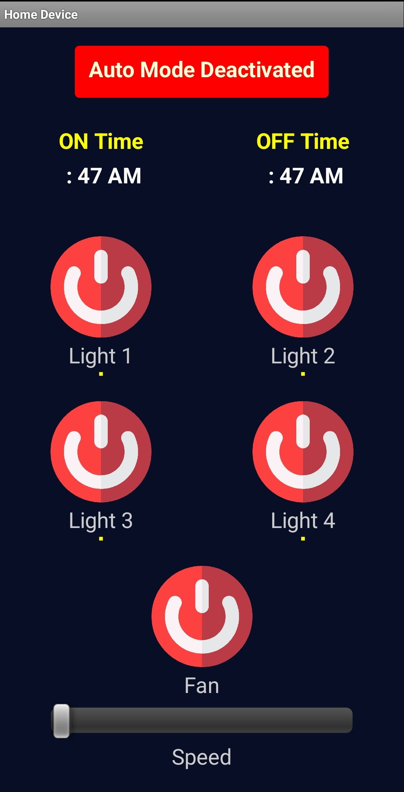

# Home Automation

## Overview

This project involves the design and implementation of a home automation system using embedded systems. The system is built around the ESP32 microcontroller for controller and communication via WiFi and Bluetooth. It allows users to control various home appliances remotely through a user-friendly mobile application.
<!-- Adjust image size using HTML -->


## Features

### WiFi and Bluetooth Connectivity:
The system utilizes ESP32 for seamless communication with home devices over WiFi and Bluetooth.

### Relays for Switching: 
The hardware includes relays for efficient switching of lights, fans, and other devices connected to the home automation system.

### Mobile App: 
A user-friendly mobile application is designed using MIT App Inventor, enabling users to control and monitor connected devices remotely.

### Firebase Integration: 
Firebase is used as the backend for the system, facilitating real-time communication and data synchronization between the mobile app and the home automation hardware.

## Installation

## Hardware Setup
- Insert the designed hardware into the home switch box.
- Ensure proper connections of relays and ESP32 for optimal performance.

## Software Setup
- Clone the repository from GitHub.
    ```bash
    git clone https://github.com/your-username/home-automation.git
    cd home-automation

- Open the mobile app project in MIT App Inventor and customize it according to your preferences.
- Configure Firebase credentials in the app and home automation hardware.
- Upload the embedded system code to the ESP32 using the Arduino IDE or preferred platform.

## Usage
- Connect the home model to the WiFi network.
- Open the mobile app and connect it to the home model.
- Use the app to control lights, fans, and other devices remotely.
- Adjust fan speed and schedule on/off times according to your preferences.

## License
This project is licensed under the [MIT License](https://opensource.org/licenses/MIT) - see the [LICENSE](LICENSE) file for details.

